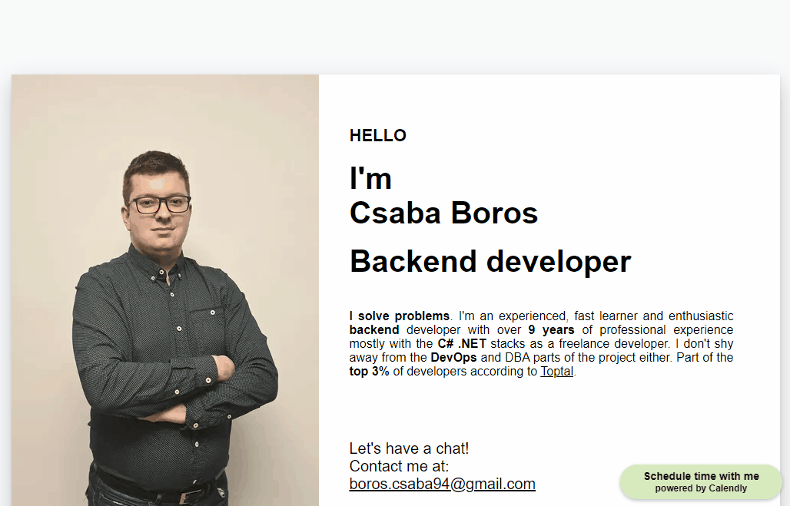

# Portfolio website
My portfolio website, live at http://www.boroscsaba.com
A static website using plain HTML, CSS and JavaScript. I used 11ty (a static website generator) for generating static pages for my blog posts without having to duplicate the structure and elements. 


# Infrastructure
The website is hosted in an AWS S3 bucket with a CloudFront distribution in front of it. The domain name is set up using Route53. The SSL certificate is provided by AWS ACM.


# Run locally
``` 
npm start
```
This will start up an 11ty local development server and open the site at http://localhost:8080/

# Deployment
The website is deployed when a change is made to the master branch using a Github Actions workflow: [deployment.yml](.github/workflows/deployment.yml)
```
name: deployment

on:
  push:
    branches:
      - master

jobs:
  deploy:
    name: Deploy to S3
    runs-on: ubuntu-latest
    steps:

      - name: Checkout code
        uses: actions/checkout@v3

      - name: Install packages
        run: npm ci

      - name: Build
        run: npm run build

      - name: Configure AWS credentials
        uses: aws-actions/configure-aws-credentials@v2
        with:
          aws-access-key-id: ${{ secrets.AWS_ACCESS_KEY_ID }}
          aws-secret-access-key: ${{ secrets.AWS_SECRET_ACCESS_KEY }}
          aws-region: us-west-1

      - name: Deploy to S3
        run: aws s3 sync ./dist s3://www.boroscsaba.com
```